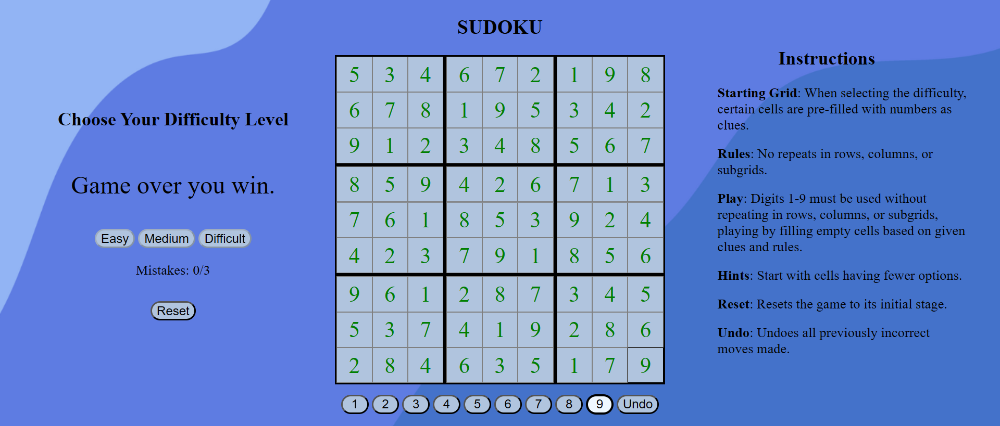

# Sudoku
### Published Date: 10/7/2024 
By: Nohaiz Kaiser

## **Overview:**
Sudoku is a fun logic puzzle played on a 9x9 grid. The goal is to fill the grid with numbers 1 through 9 so that each row, column, and 3x3 box contains every digit exactly once. It's loved for its simplicity and the mental workout it gives your brain—you'll need to use logic and strategy to crack each puzzle. Originally popularized in Japan in the 1980s, Sudoku has become a worldwide favorite, known for its ability to entertain and challenge players of all ages.

## **Technologies used:**

* HTML
* CSS
* Javascript

## **Getting started:**

A Trello board was used to keep track of development progress and can be viewed [Trello Board](https://trello.com/b/AzK1sUgT/sudoku).

The project itself was deployed and can be viewed [Sudoku Project](https://nohaiz.github.io/sudoku-game/).

## **Screenshots**
### 1. Board
After selecting the difficulty level, the Sudoku board is initialized.

### 2. Visual highlights
Visual cues highlight the selected cell, along with the corresponding row and column, indicating permissible numbers that can be placed.

### 3. Corrct Placement
Upon selecting a number from the options below, it is placed into the grid.

### 4. Incorrect Placement
If a number selected from the below number options does not match the board solution, it is still placed in the grid but displayed in red. The score increments to indicate the mistake.

### 5. Losing Board
Achieving a score of 3/3 prompts the board to auto-fill the correct numbers. The game concludes, indicating it's over, with incorrect numbers highlighted in red.

### 6. Winning Board
Completing the board before getting 3 incorrect placements changes the number color to green, signifying victory. The game announces, "Game Over: You Win."

## **Next steps:**

As the next step, I will include a note list where you can select numbers to place them in the grid as potential solutions for the Sudoku puzzle. This feature serves as a helpful reminder of the possible number placements available.

